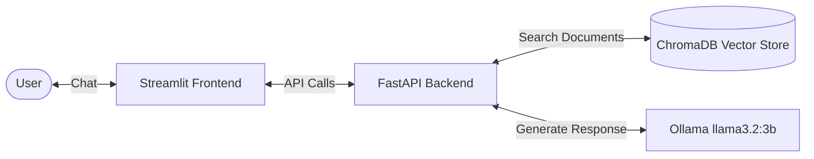

# RAG Document Assistant

A RAG (Retrieval-Augmented Generation) powered document assistant that allows users to query PDF documents using local embeddings and language models.

## Architecture



## Tech Stack

| Component | Technology |
|---|---|
| Language Model | Ollama (llama3.2:3b) |
| Embeddings | sentence-transformers (paraphrase-multilingual-MiniLM-L12-v2) |
| Vector Database | ChromaDB |
| Backend | FastAPI (Python 3.12) |
| Frontend | Streamlit |

## Project Structure

```
rag-assistant-app/
├── .gitignore
├── README.md
├── docs/
│   └── screenshots/
├── data/
│   └── raw/              # Place PDF documents here
├── backend/
│   ├── .env.example
│   ├── requirements.txt
│   ├── main.py
│   ├── model.py
│   ├── api.py
│   └── data/
│       └── vector_store/ # Generated ChromaDB index
├── frontend/
│   ├── .env.example
│   ├── requirements.txt
│   ├── api_client.py
│   └── app.py
└── notebooks/
    ├── requirements.txt
    └── rag_pipeline.ipynb
```

## Domain and Data Preparation
This project is designed to process Arabic and English text-extractable PDFs. 
To prepare your corpus, simply place your PDF documents in the `data/raw/` directory. The notebook pipeline will extract the text, chunk it, embed it using `paraphrase-multilingual-MiniLM-L12-v2`, and save the vector embeddings into ChromaDB for retrieval.

## Prerequisites
- Python 3.10+ (Python 3.12 recommended)
- [Ollama](https://ollama.ai) installed and running

## Setup Instructions

### 1. Clone the repository
```bash
git clone https://github.com/YOUR_USERNAME/rag-assistant-app.git
cd rag-assistant-app
```

### 2. Run the Notebook (Data Pipeline)
This step processes the raw PDFs and builds the vector database.
```bash
cd notebooks
python -m venv .venv
# Activate venv: `.venv\Scripts\activate` (Windows) or `source .venv/bin/activate` (Mac/Linux)
pip install -r requirements.txt
jupyter notebook
```
- Place your PDFs in the `data/raw/` directory.
- Open `rag_pipeline.ipynb` and run all cells to generate the vector database at `backend/data/vector_store/`.

### 3. Backend Setup
```bash
# Open a new terminal, from project root:
cd backend
python -m venv .venv
# Activate venv: `.venv\Scripts\activate` (Windows) or `source .venv/bin/activate` (Mac/Linux)
pip install -r requirements.txt
cp .env.example .env

# Pull the required local LLM
ollama pull llama3.2:3b

# Start the API server
uvicorn main:app --reload --host 0.0.0.0 --port 8000
```

### 4. Frontend Setup
```bash
# Open a new terminal, from project root:
cd frontend
python -m venv .venv
# Activate venv: `.venv\Scripts\activate` (Windows) or `source .venv/bin/activate` (Mac/Linux)
pip install -r requirements.txt
cp .env.example .env

# Start the Streamlit app
streamlit run app.py
```

## Environment Variables

### Backend (`backend/.env`)
| Variable | Description | Default |
|---|---|---|
| `OLLAMA_BASE_URL` | Base URL for Ollama service | `http://localhost:11434` |
| `MODEL_NAME` | Name of the Ollama model to use | `llama3.2:3b` |
| `CHROMA_PERSIST_DIR` | Directory to store ChromaDB data | `./data/vector_store` |

### Frontend (`frontend/.env`)
| Variable | Description | Default |
|---|---|---|
| `API_BASE_URL` | Base URL for the FastAPI backend | `http://localhost:8000` |

## API Reference

### Health Check
```bash
curl -X GET http://localhost:8000/health
```

### Query Documents
```bash
curl -X POST http://localhost:8000/query \
     -H "Content-Type: application/json" \
     -d '{"question": "What is the main topic of the document?"}'
```

## Evaluation Results
| Metric | Score |
|---|---|
| Faithfulness | TBD |
| Answer Relevance | TBD |
| Context Precision | TBD |

*(Evaluation metrics will be populated after running the RAG evaluation in the Jupyter notebook)*

## Screenshots


*Chat interface showing user queries and assistant responses with sources.*


*FastAPI Swagger documentation for the backend endpoints.*


*Sample evaluation results from the Jupyter notebook pipeline.*

## Git Commands to Initialize Repository

```bash
git init
git add .
git commit -m "Initial commit: RAG Document Assistant"
git branch -M main
git remote add origin https://github.com/YOUR_USERNAME/rag-assistant-app.git
git push -u origin main
```

## License
This project is licensed under the MIT License.

## Credits/Acknowledgments
- [Ollama](https://ollama.ai) for local LLM deployment.
- [ChromaDB](https://www.trychroma.com) for vector storage.
- [SentenceTransformers](https://www.sbert.net/) for embeddings.
